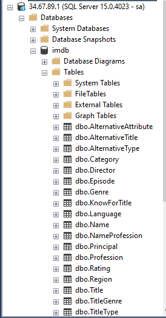
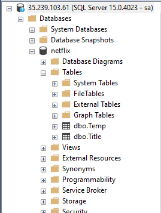
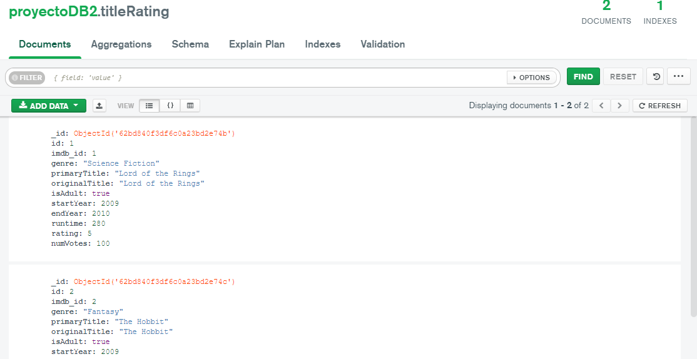

# Scripts
## Creacion de base de datos de IMDB
```sql
CREATE DATABASE imdb
GO
USE imdb
-- ************************************** "Category"
    CREATE TABLE "Category"
    (
     "id"   int NOT NULL IDENTITY(1,1) ,
     "name" varchar(200) NULL ,
    
     CONSTRAINT "PK_Category" PRIMARY KEY CLUSTERED ("id" ASC)
    );
    GO

-- ************************************** "TitleType"
    CREATE TABLE "TitleType"
    (
     "id"   int NOT NULL IDENTITY(1,1) ,
     "name" varchar(200) NULL ,
    
     CONSTRAINT "PK_TitleType" PRIMARY KEY CLUSTERED ("id" ASC)
    );
    GO

-- ************************************** "Genre"
    CREATE TABLE "Genre"
    (
     "id"   int NOT NULL IDENTITY(1,1) ,
     "name" varchar(200) NULL ,
    
     CONSTRAINT "PK_Genre" PRIMARY KEY CLUSTERED ("id" ASC)
    );
    GO

-- ************************************** "Region"
    CREATE TABLE "Region"
    (
     "id"   int NOT NULL IDENTITY(1,1) ,
     "name" varchar(200) NULL ,
    
     CONSTRAINT "PK_Region" PRIMARY KEY CLUSTERED ("id" ASC)
    );
    GO

-- ************************************** "Language"
    CREATE TABLE "Language"
    (
     "id"   int NOT NULL IDENTITY(1,1) ,
     "name" varchar(200) NULL ,
    
     CONSTRAINT "PK_Language" PRIMARY KEY CLUSTERED ("id" ASC)
    );
    GO

-- ************************************** "AlternativeType"
    CREATE TABLE "AlternativeType"
    (
     "id"   int NOT NULL IDENTITY(1,1) ,
     "name" varchar(200) NULL ,
    
     CONSTRAINT "PK_AlternativeType" PRIMARY KEY CLUSTERED ("id" ASC)
    );
    GO

-- ************************************** "AlternativeAttribute"
    CREATE TABLE "AlternativeAttribute"
    (
     "id"   int NOT NULL IDENTITY(1,1) ,
     "name" varchar(200) NULL ,
    
     CONSTRAINT "PK_AlternativeAttribute" PRIMARY KEY CLUSTERED ("id" ASC)
    );
    GO

-- ************************************** "Profession"
    CREATE TABLE "Profession"
    (
     "id"   int NOT NULL IDENTITY(1,1) ,
     "name" varchar(200) NULL ,
    
     CONSTRAINT "PK_Profession" PRIMARY KEY CLUSTERED ("id" ASC)
    );
    GO

-- ************************************** "Name"
    CREATE TABLE "Name"
    (
     "id"          int NOT NULL IDENTITY(1,1) ,
     "primaryName" varchar(200) NULL ,
     "birthYear"   int NULL ,
     "deathYear"   int NULL ,
    
     CONSTRAINT "PK_Name" PRIMARY KEY CLUSTERED ("id" ASC)
    );
    GO

-- ************************************** "NameProfession"
    CREATE TABLE "NameProfession"
    (
     "nameId"       int NOT NULL ,
     "professionId" int NOT NULL ,
    
     CONSTRAINT "FK_NameProfession_Profession" FOREIGN KEY ("professionId")  REFERENCES "Profession"("id"),
     CONSTRAINT "FK_NameProfession_Name" FOREIGN KEY ("nameId")  REFERENCES "Name"("id")
    );
    GO

-- ************************************** "Title"
    CREATE TABLE "Title"
    (
     "id"            int NOT NULL IDENTITY(1,1) ,
     "titleTypeId"   int NOT NULL ,
     "primaryTitle"  varchar(200) NULL ,
     "originalTitle" varchar(200) NULL ,
     "isAdult"       bit NULL ,
     "startYear"     int NULL ,
     "endYear"       int NULL ,
     "runtime"       int NULL ,
    
     CONSTRAINT "PK_Title" PRIMARY KEY CLUSTERED ("id" ASC),
     CONSTRAINT "FK_Title_TitleType" FOREIGN KEY ("titleTypeId")  REFERENCES "TitleType"("id")
    );
    GO

-- ************************************** "TitleGenre"
    CREATE TABLE "TitleGenre"
    (
     "titleId" int NOT NULL ,
     "genreId" int NOT NULL ,
    
     CONSTRAINT "FK_TitleGenre_Title" FOREIGN KEY ("titleId")  REFERENCES "Title"("id"),
     CONSTRAINT "FK_TitleGenre_Genre" FOREIGN KEY ("genreId")  REFERENCES "Genre"("id")
    );
    GO

-- ************************************** "AlternativeTitle"
    CREATE TABLE "AlternativeTitle"
    (
     "id"                     int NOT NULL IDENTITY(1,1) ,
     "titleId"                int NOT NULL ,
     "regionId"               int NOT NULL ,
     "languageId"             int NOT NULL ,
     "alternativeTypeId"      int NOT NULL ,
     "alternativeAttributeId" int NOT NULL ,
    
     CONSTRAINT "PK_AlternativeTitle" PRIMARY KEY CLUSTERED ("id" ASC),
     CONSTRAINT "FK_AlternativeTitle_Title" FOREIGN KEY ("titleId")  REFERENCES "Title"("id"),
     CONSTRAINT "FK_AlternativeTitle_Region" FOREIGN KEY ("regionId")  REFERENCES "Region"("id"),
     CONSTRAINT "FK_AlternativeTitle_Language" FOREIGN KEY ("languageId")  REFERENCES "Language"("id"),
     CONSTRAINT "FK_AlternativeTitle_AlternativeType" FOREIGN KEY ("alternativeTypeId")  REFERENCES "AlternativeType"("id"),
     CONSTRAINT "FK_AlternativeTitle_AlternativeAttribute" FOREIGN KEY ("alternativeAttributeId")  REFERENCES "AlternativeAttribute"("id")
    );
    GO

-- ************************************** "Rating"
    CREATE TABLE "Rating"
    (
     "id"            int NOT NULL IDENTITY(1,1) ,
     "titleId"       int NOT NULL ,
     "averageRating" float NULL ,
     "numVotes"      int NULL ,
    
     CONSTRAINT "PK_Rating" PRIMARY KEY CLUSTERED ("id" ASC),
     CONSTRAINT "FK_Rating_Title" FOREIGN KEY ("titleId")  REFERENCES "Title"("id")
    );
    GO
    
-- ************************************** "Episode"
    CREATE TABLE "Episode"
    (
     "id"       int NOT NULL IDENTITY(1,1) ,
     "titleId"  int NOT NULL ,
     "parentId" int NOT NULL ,
     "season"   int NULL ,
     "episode"  int NULL ,
    
     CONSTRAINT "PK_Episode" PRIMARY KEY CLUSTERED ("id" ASC),
     CONSTRAINT "FK_Episode_Title1" FOREIGN KEY ("titleId")  REFERENCES "Title"("id"),
     CONSTRAINT "FK_Episode_Title2" FOREIGN KEY ("parentId")  REFERENCES "Title"("id")
    );
    GO

-- ************************************** "Writer"
    CREATE TABLE "Writer"
    (
     "nameId"  int NOT NULL ,
     "titleId" int NOT NULL ,
    
     CONSTRAINT "FK_Writer_Name" FOREIGN KEY ("nameId")  REFERENCES "Name"("id"),
     CONSTRAINT "FK_Writer_Title" FOREIGN KEY ("titleId")  REFERENCES "Title"("id")
    );
    GO

-- ************************************** "Director"
    CREATE TABLE "Director"
    (
     "nameId"  int NOT NULL ,
     "titleId" int NOT NULL ,
    
     CONSTRAINT "FK_Director_Name" FOREIGN KEY ("nameId")  REFERENCES "Name"("id"),
     CONSTRAINT "FK_Director_Title" FOREIGN KEY ("titleId")  REFERENCES "Title"("id")
    );
    GO

-- ************************************** "Principal"
    CREATE TABLE "Principal"
    (
     "id"         int NOT NULL IDENTITY(1,1) ,
     "nameId"     int NOT NULL ,
     "titleId"    int NOT NULL ,
     "categoryId" int NOT NULL ,
     "jobId"      int NULL ,
     "order"      int NULL ,
     "character"  varchar(200) NULL ,
    
     CONSTRAINT "PK_Principal" PRIMARY KEY CLUSTERED ("id" ASC),
     CONSTRAINT "FK_Principal_Name" FOREIGN KEY ("nameId")  REFERENCES "Name"("id"),
     CONSTRAINT "FK_Principal_Title" FOREIGN KEY ("titleId")  REFERENCES "Title"("id"),
     CONSTRAINT "FK_Principal_Category" FOREIGN KEY ("categoryId")  REFERENCES "Category"("id")
    );
    GO

-- ************************************** "KnowForTitle"
    CREATE TABLE "KnowForTitle"
    (
     "nameId"  int NOT NULL ,
     "titleId" int NOT NULL ,
    
     CONSTRAINT "FK_KnowForTitle_Name" FOREIGN KEY ("nameId")  REFERENCES "Name"("id"),
     CONSTRAINT "FK_KnowForTitle_Title" FOREIGN KEY ("titleId")  REFERENCES "Title"("id")
    );
    GO
```
## Creacion de base de datos NETFLIX
```sql
CREATE DATABASE netflix
GO
USE netflix
GO
-- ************************************** "Title"
    CREATE TABLE "Title"
    (
     "id"            int NOT NULL IDENTITY(1,1) ,
     "imdb_id"       int NOT NULL ,
     "genre"         varchar(200) NOT NULL ,
     "primaryTitle"  varchar(200) NULL ,
     "originalTitle" varchar(200) NULL ,
     "isAdult"       bit NULL ,
     "startYear"     int NULL ,
     "endYear"       int NULL ,
     "runtime"       int NULL ,
     "created_at"    datetime DEFAULT CURRENT_TIMESTAMP
    
     CONSTRAINT "PK_Title" PRIMARY KEY CLUSTERED ("id" ASC),
    );
    GO

-- ************************************** "Temp"
    CREATE TABLE "Temp"
    (
     "id"            int NOT NULL IDENTITY(1,1) ,
     "primaryTitle"  varchar(200) NULL , 
     CONSTRAINT "PK_Temp" PRIMARY KEY CLUSTERED ("id" ASC),
    );
    GO
```
## Carga de datos
```sql
USE imdb
GO
INSERT INTO Category(name) VALUES('Category 1')
INSERT INTO Category(name) VALUES('Category 2')
INSERT INTO Category(name) VALUES('Category 3')
GO
INSERT INTO TitleType(name) VALUES('Movie')
INSERT INTO TitleType(name) VALUES('Serie')
INSERT INTO TitleType(name) VALUES('Episode')
GO
INSERT INTO Genre(name) VALUES('Action')
INSERT INTO Genre(name) VALUES('Romance')
INSERT INTO Genre(name) VALUES('Drama')
INSERT INTO Genre(name) VALUES('Horror')
INSERT INTO Genre(name) VALUES('Science Fiction')
INSERT INTO Genre(name) VALUES('Fantasy')
INSERT INTO Genre(name) VALUES('Adventure')
INSERT INTO Genre(name) VALUES('Comedy')
GO
INSERT INTO Region(name) VALUES('Europe')
INSERT INTO Region(name) VALUES('Asia')
INSERT INTO Region(name) VALUES('North America')
INSERT INTO Region(name) VALUES('South America')
GO
INSERT INTO Language(name) VALUES('English')
INSERT INTO Language(name) VALUES('Spanish')
INSERT INTO Language(name) VALUES('French')
INSERT INTO Language(name) VALUES('Russian')
GO
INSERT INTO AlternativeType(name) VALUES('Movie')
INSERT INTO AlternativeType(name) VALUES('Episode')
GO
INSERT INTO AlternativeAttribute(name) VALUES('I')
INSERT INTO AlternativeAttribute(name) VALUES('Dont')
INSERT INTO AlternativeAttribute(name) VALUES('Know')
INSERT INTO AlternativeAttribute(name) VALUES('Ok')
GO
INSERT INTO Profession(name) VALUES('Butcher')
INSERT INTO Profession(name) VALUES('Driver')
INSERT INTO Profession(name) VALUES('Director')
INSERT INTO Profession(name) VALUES('Teacher')
GO
INSERT INTO Name(primaryName, birthYear, deathYear) VALUES('Juan', 1980, 2010)
INSERT INTO Name(primaryName, birthYear, deathYear) VALUES('Maria', 1981, 2011)
INSERT INTO Name(primaryName, birthYear, deathYear) VALUES('Pedro', 1982, 2012)
INSERT INTO Name(primaryName, birthYear, deathYear) VALUES('Carlos', 1983, 2013)
GO
INSERT INTO NameProfession(nameId, professionId) VALUES(1, 1)
INSERT INTO NameProfession(nameId, professionId) VALUES(2, 1)
INSERT INTO NameProfession(nameId, professionId) VALUES(3, 2)
INSERT INTO NameProfession(nameId, professionId) VALUES(4, 2)
INSERT INTO NameProfession(nameId, professionId) VALUES(1, 3)
INSERT INTO NameProfession(nameId, professionId) VALUES(2, 3)
INSERT INTO NameProfession(nameId, professionId) VALUES(3, 4)
INSERT INTO NameProfession(nameId, professionId) VALUES(4, 4)
GO
INSERT INTO Title(titleTypeId, primaryTitle, originalTitle, isAdult, startYear, endYear, runtime) VALUES(1, 'Lord of the Rings', 'Lord of the Rings', 1, 2009, 2010, 280)
INSERT INTO Title(titleTypeId, primaryTitle, originalTitle, isAdult, startYear, endYear, runtime) VALUES(1, 'The Hobbit', 'The Hobbit', 1, 2009, 2010, 280)
INSERT INTO Title(titleTypeId, primaryTitle, originalTitle, isAdult, startYear, endYear, runtime) VALUES(1, 'About Time', 'About Time', 1, 2009, 2010, 280)
INSERT INTO Title(titleTypeId, primaryTitle, originalTitle, isAdult, startYear, endYear, runtime) VALUES(1, 'Frozen', 'Frozen', 1, 2009, 2010, 280)
INSERT INTO Title(titleTypeId, primaryTitle, originalTitle, isAdult, startYear, endYear, runtime) VALUES(2, 'How I Met Your Mother', 'How I Met Your Mother', 1, 2009, 2010, 280)
INSERT INTO Title(titleTypeId, primaryTitle, originalTitle, isAdult, startYear, endYear, runtime) VALUES(3, 'Pilot', 'Pilot', 1, 2009, 2010, 280)
INSERT INTO Title(titleTypeId, primaryTitle, originalTitle, isAdult, startYear, endYear, runtime) VALUES(1, 'Finding Nemo', 'Finding Nemo', 1, 1990, 1991, 200)
INSERT INTO Title(titleTypeId, primaryTitle, originalTitle, isAdult, startYear, endYear, runtime) VALUES(1, 'Lucky Number Slevin', 'Lucky Number Slevin', 1, 1991, 1991, 200)
INSERT INTO Title(titleTypeId, primaryTitle, originalTitle, isAdult, startYear, endYear, runtime) VALUES(1, 'Star Trek', 'Star Trek', 1, 1992, 1993, 200)
INSERT INTO Title(titleTypeId, primaryTitle, originalTitle, isAdult, startYear, endYear, runtime) VALUES(1, 'The Godfather', 'The Godfather', 1, 1993, 1994, 200)
INSERT INTO Title(titleTypeId, primaryTitle, originalTitle, isAdult, startYear, endYear, runtime) VALUES(1, 'True Romance', 'True Romance', 1, 1990, 1994, 200)
INSERT INTO Title(titleTypeId, primaryTitle, originalTitle, isAdult, startYear, endYear, runtime) VALUES(1, 'The Blues Brothers', 'The Blues Brothers', 1, 1995, 1996, 200)
INSERT INTO Title(titleTypeId, primaryTitle, originalTitle, isAdult, startYear, endYear, runtime) VALUES(1, 'The Poseidon Adventure', 'The Poseidon Adventure', 1, 1996, 1997, 200)
INSERT INTO Title(titleTypeId, primaryTitle, originalTitle, isAdult, startYear, endYear, runtime) VALUES(1, 'The Matrix', 'The Matrix', 1, 1997, 1998, 200)
INSERT INTO Title(titleTypeId, primaryTitle, originalTitle, isAdult, startYear, endYear, runtime) VALUES(1, 'The Bodyguard', 'The Bodyguard', 1, 1998, 1999, 200)
INSERT INTO Title(titleTypeId, primaryTitle, originalTitle, isAdult, startYear, endYear, runtime) VALUES(1, 'Silent Running', 'Silent Running', 1, 1999, 2000, 200)
INSERT INTO Title(titleTypeId, primaryTitle, originalTitle, isAdult, startYear, endYear, runtime) VALUES(1, 'Gattaca', 'Gattaca', 1, 1990, 1991, 200)
INSERT INTO Title(titleTypeId, primaryTitle, originalTitle, isAdult, startYear, endYear, runtime) VALUES(1, 'War of the Worlds', 'War of the Worlds', 1, 1991, 1991, 200)
INSERT INTO Title(titleTypeId, primaryTitle, originalTitle, isAdult, startYear, endYear, runtime) VALUES(1, 'The Big Lebowski', 'The Big Lebowski', 1, 1992, 1993, 200)
INSERT INTO Title(titleTypeId, primaryTitle, originalTitle, isAdult, startYear, endYear, runtime) VALUES(1, 'Braveheart', 'Braveheart', 1, 1993, 1994, 200)
INSERT INTO Title(titleTypeId, primaryTitle, originalTitle, isAdult, startYear, endYear, runtime) VALUES(1, 'Arsenic and Old Lace', 'Arsenic and Old Lace', 1, 1990, 1994, 200)
INSERT INTO Title(titleTypeId, primaryTitle, originalTitle, isAdult, startYear, endYear, runtime) VALUES(1, 'Broken Flowers', 'Broken Flowers', 1, 1995, 1996, 200)
INSERT INTO Title(titleTypeId, primaryTitle, originalTitle, isAdult, startYear, endYear, runtime) VALUES(1, 'The Ring', 'The Ring', 1, 1996, 1997, 200)
INSERT INTO Title(titleTypeId, primaryTitle, originalTitle, isAdult, startYear, endYear, runtime) VALUES(1, 'Stalag 17', 'Stalag 17', 1, 1997, 1998, 200)
INSERT INTO Title(titleTypeId, primaryTitle, originalTitle, isAdult, startYear, endYear, runtime) VALUES(1, 'Manhattan', 'Manhattan', 1, 1998, 1999, 200)
INSERT INTO Title(titleTypeId, primaryTitle, originalTitle, isAdult, startYear, endYear, runtime) VALUES(1, 'Cool Runnings', 'Cool Runnings', 1, 1999, 2000, 200)
INSERT INTO Title(titleTypeId, primaryTitle, originalTitle, isAdult, startYear, endYear, runtime) VALUES(1, 'Halloween', 'Halloween', 1, 1990, 1991, 200)
INSERT INTO Title(titleTypeId, primaryTitle, originalTitle, isAdult, startYear, endYear, runtime) VALUES(1, 'Heat', 'Heat', 1, 1991, 1991, 200)
INSERT INTO Title(titleTypeId, primaryTitle, originalTitle, isAdult, startYear, endYear, runtime) VALUES(1, 'Rope', 'Rope', 1, 1992, 1993, 200)
INSERT INTO Title(titleTypeId, primaryTitle, originalTitle, isAdult, startYear, endYear, runtime) VALUES(1, 'Next', 'Next', 1, 1993, 1994, 200)
INSERT INTO Title(titleTypeId, primaryTitle, originalTitle, isAdult, startYear, endYear, runtime) VALUES(1, 'Stuck on You', 'Stuck on You', 1, 1990, 1994, 200)
INSERT INTO Title(titleTypeId, primaryTitle, originalTitle, isAdult, startYear, endYear, runtime) VALUES(1, 'Lord of War', 'Lord of War', 1, 1995, 1996, 200)
INSERT INTO Title(titleTypeId, primaryTitle, originalTitle, isAdult, startYear, endYear, runtime) VALUES(1, 'Superman', 'Superman', 1, 1996, 1997, 200)
INSERT INTO Title(titleTypeId, primaryTitle, originalTitle, isAdult, startYear, endYear, runtime) VALUES(1, 'Hostage', 'Hostage', 1, 1997, 1998, 200)
INSERT INTO Title(titleTypeId, primaryTitle, originalTitle, isAdult, startYear, endYear, runtime) VALUES(1, 'Birthday Girl', 'Birthday Girl', 1, 1998, 1999, 200)
INSERT INTO Title(titleTypeId, primaryTitle, originalTitle, isAdult, startYear, endYear, runtime) VALUES(1, 'Romeo Must Die', 'Romeo Must Die', 1, 1999, 2000, 200)
INSERT INTO Title(titleTypeId, primaryTitle, originalTitle, isAdult, startYear, endYear, runtime) VALUES(1, 'Lost in Space', 'Lost in Space', 1, 1990, 1991, 200)
INSERT INTO Title(titleTypeId, primaryTitle, originalTitle, isAdult, startYear, endYear, runtime) VALUES(1, 'Stardust', 'Stardust', 1, 1991, 1991, 200)
INSERT INTO Title(titleTypeId, primaryTitle, originalTitle, isAdult, startYear, endYear, runtime) VALUES(1, 'Cold Mountain', 'Cold Mountain', 1, 1992, 1993, 200)
INSERT INTO Title(titleTypeId, primaryTitle, originalTitle, isAdult, startYear, endYear, runtime) VALUES(1, 'The Bounty', 'The Bounty', 1, 1993, 1994, 200)
INSERT INTO Title(titleTypeId, primaryTitle, originalTitle, isAdult, startYear, endYear, runtime) VALUES(1, 'Backdraft', 'Backdraft', 1, 1990, 1994, 200)
INSERT INTO Title(titleTypeId, primaryTitle, originalTitle, isAdult, startYear, endYear, runtime) VALUES(1, 'What Women Want', 'What Women Want', 1, 1995, 1996, 200)
INSERT INTO Title(titleTypeId, primaryTitle, originalTitle, isAdult, startYear, endYear, runtime) VALUES(1, 'Sense and Sensibility', 'Sense and Sensibility', 1, 1996, 1997, 200)
INSERT INTO Title(titleTypeId, primaryTitle, originalTitle, isAdult, startYear, endYear, runtime) VALUES(1, 'Across the Universe', 'Across the Universe', 1, 1997, 1998, 200)
INSERT INTO Title(titleTypeId, primaryTitle, originalTitle, isAdult, startYear, endYear, runtime) VALUES(1, 'August Rush', 'August Rush', 1, 1998, 1999, 200)
INSERT INTO Title(titleTypeId, primaryTitle, originalTitle, isAdult, startYear, endYear, runtime) VALUES(1, 'Rendition', 'Rendition', 1, 1999, 2000, 200)
INSERT INTO Title(titleTypeId, primaryTitle, originalTitle, isAdult, startYear, endYear, runtime) VALUES(1, 'Three Kings', 'Three Kings', 1, 1991, 1992, 200)
INSERT INTO Title(titleTypeId, primaryTitle, originalTitle, isAdult, startYear, endYear, runtime) VALUES(1, 'Practical Magic', 'Practical Magic', 1, 1993, 1991, 200)
INSERT INTO Title(titleTypeId, primaryTitle, originalTitle, isAdult, startYear, endYear, runtime) VALUES(1, 'Idle Hands', 'Idle Hands', 1, 1993, 1994, 200)
INSERT INTO Title(titleTypeId, primaryTitle, originalTitle, isAdult, startYear, endYear, runtime) VALUES(1, 'Sleeping with the Enemy', 'Sleeping with the Enemy', 1, 1994, 19951, 200)
INSERT INTO Title(titleTypeId, primaryTitle, originalTitle, isAdult, startYear, endYear, runtime) VALUES(1, 'Shooter', 'Shooter', 1, 1995, 1996, 200)
INSERT INTO Title(titleTypeId, primaryTitle, originalTitle, isAdult, startYear, endYear, runtime) VALUES(1, 'Cocktail', 'Cocktail', 1, 1996, 1997, 200)
GO
INSERT INTO TitleGenre(titleId, genreId) VALUES(1, 1)
INSERT INTO TitleGenre(titleId, genreId) VALUES(2, 2)
INSERT INTO TitleGenre(titleId, genreId) VALUES(3, 3)
INSERT INTO TitleGenre(titleId, genreId) VALUES(4, 4)
INSERT INTO TitleGenre(titleId, genreId) VALUES(5, 5)
INSERT INTO TitleGenre(titleId, genreId) VALUES(6, 6)
INSERT INTO TitleGenre(titleId, genreId) VALUES(7, 1)
INSERT INTO TitleGenre(titleId, genreId) VALUES(8, 2)
INSERT INTO TitleGenre(titleId, genreId) VALUES(9, 3)
INSERT INTO TitleGenre(titleId, genreId) VALUES(10, 4)
INSERT INTO TitleGenre(titleId, genreId) VALUES(11, 5)
INSERT INTO TitleGenre(titleId, genreId) VALUES(12, 6)
INSERT INTO TitleGenre(titleId, genreId) VALUES(13, 1)
INSERT INTO TitleGenre(titleId, genreId) VALUES(14, 2)
INSERT INTO TitleGenre(titleId, genreId) VALUES(15, 3)
INSERT INTO TitleGenre(titleId, genreId) VALUES(16, 4)
INSERT INTO TitleGenre(titleId, genreId) VALUES(17, 5)
INSERT INTO TitleGenre(titleId, genreId) VALUES(18, 6)
INSERT INTO TitleGenre(titleId, genreId) VALUES(19, 1)
INSERT INTO TitleGenre(titleId, genreId) VALUES(20, 2)
INSERT INTO TitleGenre(titleId, genreId) VALUES(21, 3)
INSERT INTO TitleGenre(titleId, genreId) VALUES(22, 4)
INSERT INTO TitleGenre(titleId, genreId) VALUES(23, 5)
INSERT INTO TitleGenre(titleId, genreId) VALUES(24, 6)
INSERT INTO TitleGenre(titleId, genreId) VALUES(25, 1)
INSERT INTO TitleGenre(titleId, genreId) VALUES(26, 2)
INSERT INTO TitleGenre(titleId, genreId) VALUES(27, 3)
INSERT INTO TitleGenre(titleId, genreId) VALUES(28, 4)
INSERT INTO TitleGenre(titleId, genreId) VALUES(29, 5)
INSERT INTO TitleGenre(titleId, genreId) VALUES(30, 6)
INSERT INTO TitleGenre(titleId, genreId) VALUES(31, 1)
INSERT INTO TitleGenre(titleId, genreId) VALUES(32, 2)
INSERT INTO TitleGenre(titleId, genreId) VALUES(33, 3)
INSERT INTO TitleGenre(titleId, genreId) VALUES(34, 4)
INSERT INTO TitleGenre(titleId, genreId) VALUES(35, 5)
INSERT INTO TitleGenre(titleId, genreId) VALUES(36, 6)
INSERT INTO TitleGenre(titleId, genreId) VALUES(37, 1)
INSERT INTO TitleGenre(titleId, genreId) VALUES(38, 2)
INSERT INTO TitleGenre(titleId, genreId) VALUES(39, 3)
INSERT INTO TitleGenre(titleId, genreId) VALUES(40, 4)
INSERT INTO TitleGenre(titleId, genreId) VALUES(41, 5)
INSERT INTO TitleGenre(titleId, genreId) VALUES(42, 6)
INSERT INTO TitleGenre(titleId, genreId) VALUES(43, 1)
INSERT INTO TitleGenre(titleId, genreId) VALUES(44, 2)
INSERT INTO TitleGenre(titleId, genreId) VALUES(45, 3)
INSERT INTO TitleGenre(titleId, genreId) VALUES(46, 4)
INSERT INTO TitleGenre(titleId, genreId) VALUES(47, 5)
INSERT INTO TitleGenre(titleId, genreId) VALUES(48, 6)
INSERT INTO TitleGenre(titleId, genreId) VALUES(49, 1)
INSERT INTO TitleGenre(titleId, genreId) VALUES(50, 2)
INSERT INTO TitleGenre(titleId, genreId) VALUES(51, 3)
INSERT INTO TitleGenre(titleId, genreId) VALUES(52, 4)
GO
INSERT INTO AlternativeTitle(titleId, regionId, languageId, alternativeTypeId, alternativeAttributeId) VALUES(1, 1, 1, 1, 1)
INSERT INTO AlternativeTitle(titleId, regionId, languageId, alternativeTypeId, alternativeAttributeId) VALUES(2, 2, 2, 2, 2)
INSERT INTO AlternativeTitle(titleId, regionId, languageId, alternativeTypeId, alternativeAttributeId) VALUES(3, 3, 1, 1, 3)
INSERT INTO AlternativeTitle(titleId, regionId, languageId, alternativeTypeId, alternativeAttributeId) VALUES(4, 4, 2, 2, 4)
INSERT INTO AlternativeTitle(titleId, regionId, languageId, alternativeTypeId, alternativeAttributeId) VALUES(5, 1, 1, 1, 1)
INSERT INTO AlternativeTitle(titleId, regionId, languageId, alternativeTypeId, alternativeAttributeId) VALUES(6, 2, 2, 2, 2)
GO
INSERT INTO Rating(titleId, averageRating, numVotes) VALUES(1, 5.0, 100)
INSERT INTO Rating(titleId, averageRating, numVotes) VALUES(2, 4.3, 900)
INSERT INTO Rating(titleId, averageRating, numVotes) VALUES(3, 2.5, 500)
INSERT INTO Rating(titleId, averageRating, numVotes) VALUES(4, 4.9, 10)
INSERT INTO Rating(titleId, averageRating, numVotes) VALUES(5, 5.0, 321)
INSERT INTO Rating(titleId, averageRating, numVotes) VALUES(6, 4.9, 542)
INSERT INTO Rating(titleId, averageRating, numVotes) VALUES(7, 5.0, 123)
INSERT INTO Rating(titleId, averageRating, numVotes) VALUES(8, 3.2, 5434)
INSERT INTO Rating(titleId, averageRating, numVotes) VALUES(9, 2.6, 765)
INSERT INTO Rating(titleId, averageRating, numVotes) VALUES(10, 2.7, 123)
INSERT INTO Rating(titleId, averageRating, numVotes) VALUES(11, 3.6, 65)
INSERT INTO Rating(titleId, averageRating, numVotes) VALUES(12, 3.4, 54)
INSERT INTO Rating(titleId, averageRating, numVotes) VALUES(13, 2.2, 62)
INSERT INTO Rating(titleId, averageRating, numVotes) VALUES(14, 1.2, 432)
INSERT INTO Rating(titleId, averageRating, numVotes) VALUES(15, 2.5, 123)
INSERT INTO Rating(titleId, averageRating, numVotes) VALUES(16, 3.9, 34)
INSERT INTO Rating(titleId, averageRating, numVotes) VALUES(17, 5.0, 123)
INSERT INTO Rating(titleId, averageRating, numVotes) VALUES(18, 3.2, 5434)
INSERT INTO Rating(titleId, averageRating, numVotes) VALUES(19, 2.6, 765)
INSERT INTO Rating(titleId, averageRating, numVotes) VALUES(20, 2.7, 123)
INSERT INTO Rating(titleId, averageRating, numVotes) VALUES(21, 3.6, 65)
INSERT INTO Rating(titleId, averageRating, numVotes) VALUES(22, 3.4, 54)
INSERT INTO Rating(titleId, averageRating, numVotes) VALUES(23, 2.2, 62)
INSERT INTO Rating(titleId, averageRating, numVotes) VALUES(24, 1.2, 432)
INSERT INTO Rating(titleId, averageRating, numVotes) VALUES(25, 2.5, 123)
INSERT INTO Rating(titleId, averageRating, numVotes) VALUES(26, 3.9, 34)
INSERT INTO Rating(titleId, averageRating, numVotes) VALUES(27, 5.0, 123)
INSERT INTO Rating(titleId, averageRating, numVotes) VALUES(28, 3.2, 5434)
INSERT INTO Rating(titleId, averageRating, numVotes) VALUES(29, 2.6, 765)
INSERT INTO Rating(titleId, averageRating, numVotes) VALUES(30, 2.7, 123)
INSERT INTO Rating(titleId, averageRating, numVotes) VALUES(31, 3.6, 65)
INSERT INTO Rating(titleId, averageRating, numVotes) VALUES(32, 3.4, 54)
INSERT INTO Rating(titleId, averageRating, numVotes) VALUES(33, 2.2, 62)
INSERT INTO Rating(titleId, averageRating, numVotes) VALUES(34, 1.2, 432)
INSERT INTO Rating(titleId, averageRating, numVotes) VALUES(35, 2.5, 123)
INSERT INTO Rating(titleId, averageRating, numVotes) VALUES(36, 3.9, 34)
INSERT INTO Rating(titleId, averageRating, numVotes) VALUES(37, 5.0, 123)
INSERT INTO Rating(titleId, averageRating, numVotes) VALUES(38, 3.2, 5434)
INSERT INTO Rating(titleId, averageRating, numVotes) VALUES(39, 2.6, 765)
INSERT INTO Rating(titleId, averageRating, numVotes) VALUES(40, 2.7, 123)
INSERT INTO Rating(titleId, averageRating, numVotes) VALUES(41, 3.6, 65)
INSERT INTO Rating(titleId, averageRating, numVotes) VALUES(42, 3.4, 54)
INSERT INTO Rating(titleId, averageRating, numVotes) VALUES(43, 2.2, 62)
INSERT INTO Rating(titleId, averageRating, numVotes) VALUES(44, 1.2, 432)
INSERT INTO Rating(titleId, averageRating, numVotes) VALUES(45, 2.5, 123)
INSERT INTO Rating(titleId, averageRating, numVotes) VALUES(46, 3.9, 34)
INSERT INTO Rating(titleId, averageRating, numVotes) VALUES(47, 5.0, 123)
INSERT INTO Rating(titleId, averageRating, numVotes) VALUES(48, 3.2, 5434)
INSERT INTO Rating(titleId, averageRating, numVotes) VALUES(49, 2.6, 765)
INSERT INTO Rating(titleId, averageRating, numVotes) VALUES(50, 2.7, 123)
INSERT INTO Rating(titleId, averageRating, numVotes) VALUES(51, 3.6, 65)
INSERT INTO Rating(titleId, averageRating, numVotes) VALUES(52, 3.4, 54)
GO
INSERT INTO Episode(titleId, parentId, season, episode) VALUES(6, 5, 13.9, 34, 1)
GO
INSERT INTO Writer(nameId, titleId) VALUES(1, 1)
INSERT INTO Writer(nameId, titleId) VALUES(2, 2)
INSERT INTO Writer(nameId, titleId) VALUES(3, 3)
GO
INSERT INTO Director(nameId, titleId) VALUES(1, 1)
INSERT INTO Director(nameId, titleId) VALUES(2, 2)
INSERT INTO Director(nameId, titleId) VALUES(3, 3)
GO
INSERT INTO Principal(nameId, titleId, categoryId, jobId, order, character) VALUES(1, 1, 1, 1, 1, 'Primary')
INSERT INTO Principal(nameId, titleId, categoryId, jobId, order, character) VALUES(1, 2, 2, 2, 2, 'Secondary')
INSERT INTO Principal(nameId, titleId, categoryId, jobId, order, character) VALUES(1, 3, 3, 3, 3, 'Third')
INSERT INTO Principal(nameId, titleId, categoryId, jobId, order, character) VALUES(1, 4, 1, 1, 1, 'Primary')
INSERT INTO Principal(nameId, titleId, categoryId, jobId, order, character) VALUES(1, 5, 2, 2, 2, 'Secondary')
INSERT INTO Principal(nameId, titleId, categoryId, jobId, order, character) VALUES(1, 6, 3, 3, 3, 'Third')
GO
INSERT INTO KnowForTitle(nameId, titleId) VALUES(1, 1)
INSERT INTO KnowForTitle(nameId, titleId) VALUES(2, 2)
INSERT INTO KnowForTitle(nameId, titleId) VALUES(3, 3)
INSERT INTO KnowForTitle(nameId, titleId) VALUES(4, 4)
INSERT INTO KnowForTitle(nameId, titleId) VALUES(5, 5)
INSERT INTO KnowForTitle(nameId, titleId) VALUES(6, 6)
GO
```
## Conexion entre IMDB y NETFLIX
```sql
-- Llamada al procedimiento para agregar un servidor
EXEC sp_addlinkedserver
      @server= 'IMDB', 
      @srvproduct='',
      @provider='SQLNCLI',
      @datasrc='34.67.89.1',
      @catalog ='imdb',
      @provstr='Integrated Security=SSPI'

-- Llamada al procedimiento para loggearnos al servidor
EXEC sp_addlinkedsrvlogin 'IMDB', 'false', NULL, 'sa', 'Myp4ssword'
```
## Creacion de Storaged Procedure
```sql
-- Creacion del procedimiento que consume los datos IMDB y los inserta en NETFLIX
DROP PROCEDURE IF EXISTS InsertTitle
GO
CREATE PROCEDURE InsertTitle @primary varchar(200), @original varchar(200)
AS
BEGIN
      DECLARE @imdb_id        int
      DECLARE @genre          varchar(200)
      DECLARE @primaryTitle   varchar(200)
      DECLARE @originalTitle  varchar(200)
      DECLARE @isAdult        bit
      DECLARE @startYear      int
      DECLARE @endYear        int
      DECLARE @runtime        int
      SELECT 
            @imdb_id          = title.id,
            @genre            = genre.name,
            @primaryTitle     = title.primaryTitle,
            @originalTitle    = title.originalTitle,
            @isAdult          = title.isAdult,
            @startYear        = title.startYear,
            @endYear          = title.endYear,
            @runtime          = title.runtime
      FROM 
            [IMDB].[imdb].[dbo].Title           AS title,
            [IMDB].[imdb].[dbo].Genre           AS genre,
            [IMDB].[imdb].[dbo].TitleGenre      AS titleGenre
      WHERE
            title.primaryTitle      = @primary AND
            title.originalTitle     = @original AND
            titleGenre.titleId      = title.id AND
            titleGenre.genreId      = genre.id

      INSERT INTO Title
            (
                  imdb_id,
                  genre,
                  primaryTitle,
                  originalTitle,
                  isAdult,
                  startYear,
                  endYear,
                  runtime
            )
      VALUES
            (
                  @imdb_id,
                  @genre,
                  @primaryTitle,
                  @originalTitle,
                  @isAdult,
                  @startYear,
                  @endYear,
                  @runtime
            )

      INSERT INTO Temp
            (
                  primaryTitle
            )
      VALUES
            (
                  @primaryTitle
            )
END
```
## Llamadas al procedimiento almacenado
```sql
-- Insertando los datos en netflix
EXEC InsertTitle @primary = 'Lord of the Rings', @original ='Lord of the Rings'
EXEC InsertTitle @primary = 'The Hobbit', @original ='The Hobbit'
EXEC InsertTitle @primary = 'About Time', @original ='About Time'
EXEC InsertTitle @primary = 'Frozen', @original ='Frozen'
EXEC InsertTitle @primary = 'How I Met Your Mother', @original ='How I Met Your Mother'
EXEC InsertTitle @primary = 'Pilot', @original ='Pilot'
EXEC InsertTitle @primary = 'Finding Nemo', @original = 'Finding Nemo'
EXEC InsertTitle @primary = 'Lucky Number Slevin', @original = 'Lucky Number Slevin'
EXEC InsertTitle @primary = 'Star Trek', @original = 'Star Trek'
EXEC InsertTitle @primary = 'The Godfather', @original = 'The Godfather'
EXEC InsertTitle @primary = 'True Romance', @original = 'True Romance'
EXEC InsertTitle @primary = 'The Blues Brothers', @original = 'The Blues Brothers'
EXEC InsertTitle @primary = 'The Poseidon Adventure', @original = 'The Poseidon Adventure'
EXEC InsertTitle @primary = 'The Matrix', @original = 'The Matrix'
EXEC InsertTitle @primary = 'The Bodyguard', @original = 'The Bodyguard'
EXEC InsertTitle @primary = 'Silent Running', @original = 'Silent Running'
EXEC InsertTitle @primary = 'Gattaca', @original = 'Gattaca'
EXEC InsertTitle @primary = 'War of the Worlds', @original = 'War of the Worlds'
EXEC InsertTitle @primary = 'The Big Lebowski', @original = 'The Big Lebowski'
EXEC InsertTitle @primary = 'Braveheart', @original = 'Braveheart'
EXEC InsertTitle @primary = 'Arsenic and Old Lace', @original = 'Arsenic and Old Lace'
EXEC InsertTitle @primary = 'Broken Flowers', @original = 'Broken Flowers'
EXEC InsertTitle @primary = 'The Ring', @original = 'The Ring'
EXEC InsertTitle @primary = 'Stalag 17', @original = 'Stalag 17'
EXEC InsertTitle @primary = 'Manhattan', @original = 'Manhattan'
EXEC InsertTitle @primary = 'Cool Runnings', @original = 'Cool Runnings'
EXEC InsertTitle @primary = 'Halloween', @original = 'Halloween'
EXEC InsertTitle @primary = 'Heat', @original = 'Heat'
EXEC InsertTitle @primary = 'Rope', @original = 'Rope'
EXEC InsertTitle @primary = 'Next', @original = 'Next'
EXEC InsertTitle @primary = 'Stuck on You', @original = 'Stuck on You'
EXEC InsertTitle @primary = 'Lord of War', @original = 'Lord of War'
EXEC InsertTitle @primary = 'Superman', @original = 'Superman'
EXEC InsertTitle @primary = 'Hostage', @original = 'Hostage'
EXEC InsertTitle @primary = 'Birthday Girl', @original = 'Birthday Girl'
EXEC InsertTitle @primary = 'Romeo Must Die', @original = 'Romeo Must Die'
EXEC InsertTitle @primary = 'Lost in Space', @original = 'Lost in Space'
EXEC InsertTitle @primary = 'Stardust', @original = 'Stardust'
EXEC InsertTitle @primary = 'Cold Mountain', @original = 'Cold Mountain'
EXEC InsertTitle @primary = 'The Bounty', @original = 'The Bounty'
EXEC InsertTitle @primary = 'Backdraft', @original = 'Backdraft'
EXEC InsertTitle @primary = 'What Women Want', @original = 'What Women Want'
EXEC InsertTitle @primary = 'Sense and Sensibility', @original = 'Sense and Sensibility'
EXEC InsertTitle @primary = 'Across the Universe', @original = 'Across the Universe'
EXEC InsertTitle @primary = 'August Rush', @original = 'August Rush'
EXEC InsertTitle @primary = 'Rendition', @original = 'Rendition'
EXEC InsertTitle @primary = 'Three Kings', @original = 'Three Kings'
EXEC InsertTitle @primary = 'Practical Magic', @original = 'Practical Magic'
EXEC InsertTitle @primary = 'Idle Hands', @original = 'Idle Hands'
EXEC InsertTitle @primary = 'Sleeping with the Enemy', @original = 'Sleeping with the Enemy'
EXEC InsertTitle @primary = 'Shooter', @original = 'Shooter'
EXEC InsertTitle @primary = 'Cocktail', @original = 'Cocktail'
```
## Query utilizado para obtener los datos de ambas bases de datos 
```sql
-- Query para obtener los datos todos los id de la tabla temporal
SELECT
      Title.id AS id,
      Title.imdb_id AS imdb_id,
      Title.genre AS genre,
      Title.primaryTitle AS primaryTitle,
      Title.originalTitle AS originalTitle,
      Title.isAdult AS isAdult,
      Title.startYear AS startYear,
      Title.endYear AS endYear,
      Title.runtime AS runtime,
      Rating.averageRating AS rating,
      Rating.numVotes AS numVotes
FROM 
      Title,
      [IMDB].[imdb].[dbo].Rating AS Rating
WHERE
      Title.id IN
      (
            SELECT
                  id
            FROM
                  Temp
      ) AND
      Rating.titleId = Title.imdb_id
```
## Docker compose IMDB
```yml
version: "3.1"

services:
  sqlserver:
    image: mcr.microsoft.com/mssql/server:2019-CU3-ubuntu-18.04
    user: '0:0'
    container_name: sqlserver2019
    ports:
      - 1433:1433
    environment:
      ACCEPT_EULA: Y
      SA_PASSWORD: Myp4ssword
      MSSQL_PID: Express
    volumes:
      - ~/docker/sqlserver-data:/var/opt/mssql
```
## Docker compose NETFLIX
```yml
version: "3.1"

services:
  sqlserver:
    image: mcr.microsoft.com/mssql/server:2019-CU3-ubuntu-18.04
    user: '0:0'
    container_name: sqlserver2019
    ports:
      - 1433:1433
    environment:
      ACCEPT_EULA: Y
      SA_PASSWORD: Myp4ssword
      MSSQL_PID: Express
    volumes:
      - ~/docker/sqlserver-data:/var/opt/mssql
  mongodb:
    image: mongo:5.0
    ports:
      - 27017:27017
    volumes:
      - ~/apps/mongo:/data/db
    environment:
      - MONGO_INITDB_ROOT_USERNAME=root
      - MONGO_INITDB_ROOT_PASSWORD=root
```
# Imagenes


